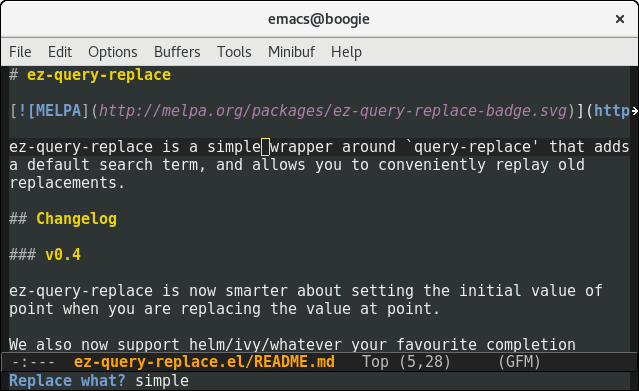
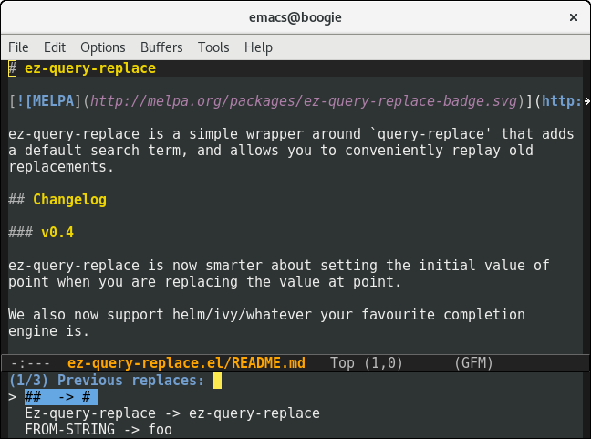

# ez-query-replace

ez-query-replace is a simple wrapper around `query-replace` that adds
a default search term, and allows you to conveniently replay old
replacements.

## Usage

### Default text

In the screenshot above, you can see `M-x ez-query-replace` offering the
symbol at point by default.

**Tip**: You can use `M-p` (bound to `previous-history-element`) to
access the text you're replacing. This great when you want to replace
"fooba" with "foobar".

### Replaying previous replacements

In the screenshot above, `M-x ez-query-replace-repeat` offers previous
replacements with completion. I'm
using [swiper](https://github.com/abo-abo/swiper) here but ido and
helm work too.

## Changelog

### v0.5

ez-query-replace-repeat now reorders history, making it easier to
replay common replacements.

Fixed crash on replaying replacements.

### v0.4

ez-query-replace is now smarter about setting the initial value of
point when you are replacing the value at point.

We also now support helm/ivy/whatever your favourite completion
engine is.

If point is midway through a replacement string, we now correctly
replace it.

### v0.3

If the region is active when ez-query-replace is called, we deactivate
it after reading its contents. The active region just gets in the way
when you're replacing values.

### v0.2

Improved the minibuffer prompt: say what we're replacing when we do
the replacement.

### v0.1

Initial release.
